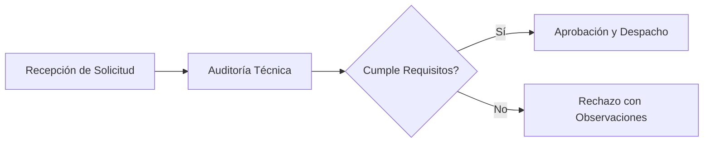

```mermaid
gantt
    title Cronograma de Implementación Operativa
    dateFormat  X
    axisFormat Sem %s
    section Fase 1
    Diagnóstico Inicial : 0, 3
    section Fase 2
    Rediseño de Procesos : 3, 6
    section Fase 3
    Auditoría y Cierre : 6, 8
```

# Guía de Estilo y Sintaxis - Zhakyz PDF Assembler v2.0

Esta guía documenta los componentes, etiquetas y directrices de maquetación compatibles con el motor de ensamblado de PDFs corporativos de **Zhakyz & Asociados**.

---

## 1. Encabezado Frontmatter (YAML)

Cada archivo Markdown (`.md`) puede iniciar con un bloque de metadatos para personalizar automáticamente la portada institucional y la cabecera:

```yaml
---
title: "Título Principal del Documento"
subtitle: "Subtítulo explicativo o alcance del informe"
author: "Nombre del Autor / Consultor"
area: "Administración Empresarial"
date: "Septiembre 2026"
version: "v1.0 Final"
has_cover: true
toc: true
confidential: "Documento Confidencial - Zhakyz & Asociados"
contact: "zhakyzasociados@gmail.com"
---
```

### Campos disponibles:
- **`title`**: Título principal en portada y cabecera superior.
- **`subtitle`**: Bajada descriptiva en portada.
- **`author`**: Autor, equipo consultor o responsable técnico.
- **`area`**: Materia, cátedra universitaria o área de especialidad.
- **`date`**: Fecha visible (por defecto: mes y año en curso).
- **`version`**: Estado o versión del documento.
- **`has_cover`**: `true` (por defecto) genera portada oficial; `false` produce un flujo continuo tipo memorándum.
- **`toc`**: `true` genera automáticamente un Índice de Contenidos estructurado a partir de los títulos H1 y H2.
- **`confidential`**: Texto de confidencialidad al pie de la portada.
- **`contact`**: Correo oficial de contacto (por defecto: `zhakyzasociados@gmail.com`).

---

## 2. Diagramas Nativos con Mermaid.js

El motor incluye integración nativa y offline con Mermaid. Puede incluir diagramas de flujo, cronogramas Gantt, diagramas de clases u organigramas:

### 2.1 Flujograma de Procesos (Flowchart)
````markdown

````

### 2.2 Cronograma de Proyecto (Gantt)
````markdown

````

---

## 3. Componentes Visuales Enriquecidos

### 3.1 Cajas de Alerta (Callouts)
Se pueden redactar en sintaxis estándar de GitHub o usando clases HTML:

#### Sintaxis Markdown:
```markdown
> [!NOTE]
> Bloque informativo con borde y fondo azul.

> [!TIP]
> Bloque de recomendación o sugerencia con borde verde.

> [!IMPORTANT]
> Advertencia de relevancia operativa con borde ámbar.

> [!CAUTION]
> Bloque de riesgo crítico con borde rojo.
```

---

### 3.2 Tarjetas de Indicadores Clave (KPI Grid)
Para resaltar métricas cuantitativas, márgenes de rentabilidad o SLAs:

```html
<div class="kpi-grid">
  <div class="kpi-card">
    <div class="kpi-value">+24%</div>
    <div class="kpi-label">Margen EBITDA</div>
  </div>
  <div class="kpi-card">
    <div class="kpi-value">-35%</div>
    <div class="kpi-label">Tiempo de Ciclo</div>
  </div>
  <div class="kpi-card">
    <div class="kpi-value">99.4%</div>
    <div class="kpi-label">Nivel de Servicio (SLA)</div>
  </div>
</div>
```

---

### 3.3 Cuadro Resumen de Presupuesto (Pricing Summary)
Para propuestas comerciales y cotizaciones:

```html
<div class="pricing-summary">
  <div class="pricing-row">
    <span>Subtotal:</span>
    <span>$5,000.00</span>
  </div>
  <div class="pricing-row">
    <span>Bonificación:</span>
    <span>-$500.00</span>
  </div>
  <div class="pricing-row pricing-total">
    <span>Total Final:</span>
    <span>$4,500.00 USD</span>
  </div>
</div>
```

---

### 3.4 Encabezado para Minutas y Memorándums (Memo Header)
Para actas de reunión o notas internas sin portada (`has_cover: false`):

```html
<div class="memo-header">
  <div class="memo-grid">
    <div><strong>Para:</strong> Miembros del Directorio</div>
    <div><strong>De:</strong> Equipo de Consultoría Zhakyz</div>
    <div><strong>Fecha:</strong> Septiembre 2026</div>
    <div><strong>Asunto:</strong> Minuta de Sesión Operativa</div>
  </div>
</div>
```

---

### 3.5 Tablas Ejecutivas
Las tablas estándar en Markdown se formatean automáticamente con cabecera oscura (`#0F172A`), texto blanco y filas alternadas con fondo sutil:

```markdown
| Dimensión | Diagnóstico | Riesgo Operativo | Prioridad |
| :--- | :--- | :--- | :--- |
| **Finanzas** | Flujo consolidado | Bajo | Media |
| **Operaciones** | Cuello de botella | Alto | Inmediata |
```

---

### 3.6 Saltos de Página y Control de Huérfanos
Para forzar que una sección comience en una nueva página:

```html
<div class="page-break"></div>
```

Para evitar que un bloque se divida entre páginas:
```html
<div class="avoid-break">
  <!-- Contenido agrupado -->
</div>
```

---

### 3.7 Bloque de Firmas y Validación Institucional
Al pie de propuestas comerciales o informes finales:

```html
<div class="signature-block">
  <div class="signature-line">
    <div class="signature-name">Zhakyz & Asociados</div>
    <div class="signature-role">Dirección de Consultoría Estratégica</div>
  </div>
  <div class="signature-line">
    <div class="signature-name">Cátedra de Administración Empresarial</div>
    <div class="signature-role">Evaluación y Auditoría Académica</div>
  </div>
</div>
```
