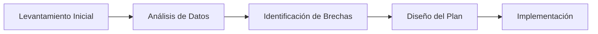

# 1. Introducción y Contexto

El propósito de este informe es evaluar los procesos clave de negocio, identificando oportunidades de mejora en eficiencia, costos y gobernanza corporativa.

> [!NOTE]
> Este documento ha sido preparado bajo los estándares metodológicos de Zhakyz & Asociados.

# 2. Indicadores Principales

  

    
+15%

    
Eficiencia Operativa

  

  

    
-20%

    
Costos Indirectos

  

  

    
98.5%

    
Conformidad de Calidad

  

# 3. Flujo del Proceso Operativo

# 4. Hallazgos y Matriz de Riesgos

| Área de Negocio | Situación Encontrada | Nivel de Riesgo | Recomendación Inmediata |
| :--- | :--- | :--- | :--- |
| **Operaciones** | Cuellos de botella en despacho | Alto | Automatización de inventario |
| **Finanzas** | Tiempos prolongados de cobranza | Medio | Política de descuentos por pronto pago |

# 5. Conclusiones y Próximos Pasos

Se recomienda avanzar con la fase de implementación durante el próximo trimestre fiscal.

  

    
Consultor Principal

    
Zhakyz & Asociados

  

  

    
Dirección General

    
Aprobación Técnica

  

