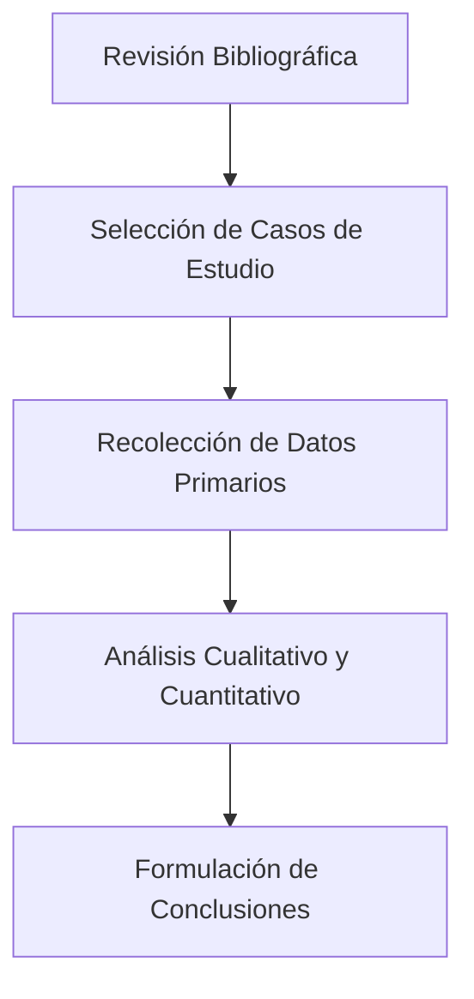

# Resumen (Abstract)

El presente trabajo examina la evolución de los modelos de planeación estratégica en organizaciones contemporáneas, contrastando el enfoque clásico de Porter con la teoría de recursos y capacidades de Barney. Se analizan implicancias operativas para la toma de decisiones en mercados volátiles.

**Palabras clave:** Administración estratégica, cadena de valor, ventaja competitiva, toma de decisiones.

---

# 1. Introducción y Planteamiento del Problema

La dinámica de mercado actual exige que las organizaciones adopten mecanismos ágiles de respuesta frente a la disrupción tecnológica. En este contexto, surge la interrogante: *¿Cómo pueden las pequeñas y medianas empresas balancear la eficiencia operativa con la innovación estratégica?*

# 2. Marco Teórico

## 2.1 Enfoque de Posicionamiento Competitivo
El modelo de las cinco fuerzas competitivas postula que la rentabilidad de una industria depende de su estructura básica.

## 2.2 Visión Basada en los Recursos (VBR)
A diferencia del enfoque externo, la VBR sostiene que los recursos valiosos, raros, inimitables y organizados (VRIO) constituyen el fundamento de la rentabilidad superior.

# 3. Metodología de Investigación

# 4. Análisis de Resultados

| Variable de Comparación | Enfoque Porteriano | Visión VBR | Síntesis Aplicada |
| :--- | :--- | :--- | :--- |
| **Foco Estratégico** | Estructura de la industria | Capacidades internas | Estrategia híbrida |
| **Fuente de Ventaja** | Posicionamiento de mercado | Recursos inimitables | Competencias dinámicas |

# 5. Conclusiones

Se concluye que la integración sinérgica de ambas perspectivas permite a las empresas diseñar modelos de negocio resilientes.

# Referencias Bibliográficas

- Barney, J. (1991). *Firm resources and sustained competitive advantage*. Journal of Management.
- Porter, M. E. (1985). *Competitive Advantage: Creating and Sustaining Superior Performance*. Free Press.
